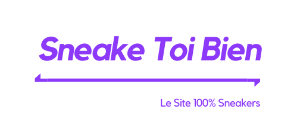

<div align="center">
  <h1>ScrapySneake</h1>
</div>


<div align="center">
  
  [](https://codeclimate.com/github/yohann-kevin/scrapysneake/maintainability)
  [](https://www.codacy.com/gh/yohann-kevin/scrapysneake/dashboard?utm_source=github.com&amp;utm_medium=referral&amp;utm_content=yohann-kevin/scrapysneake&amp;utm_campaign=Badge_Grade)
  [](https://circleci.com/gh/yohann-kevin/scrapysneake)
  [](https://img.shields.io/badge/language-ruby-red)
  [](https://github.com/yohann-kevin/scrapysneake/issues)
  [](https://snyk.io/test/github/yohann-kevin/scrapysneake)
  [](https://github.com/ellerbrock/open-source-badges/)
  
</div>

scrapysneake the scraping bot for the sneake yourself well site. [this site](https://thirsty-benz-644286.netlify.app/#/)

<div align="center">
	
</div>
This platform is a price comparison for sneakers. Eventually, the platform will set up an API to retrieve all sneaker data.

## Technology

- ruby and ruby on  rails
- sqlite3 on developpment and mysql2 for produciton
- Rspec for test application
- deploy with heroku [view deployment](https://scrapysneake.herokuapp.com/)
- CircleCI for continuous integration 

## How to install this project

in order to install the project start by cloning the repository

```shell
git clone https://github.com/yohann-kevin/scrapysneake.git
cd scrappysneake
```

then it will be necessary to install all the dependencies

```shell
bundle install
```

once the dependencies are installed, you will have to configure the local database in the database.yml.

```yaml
default: &default
  adapter: sqlite3
  pool: <%= ENV.fetch("RAILS_MAX_THREADS") { 5 } %>
  timeout: 5000

development:
  <<: *default
  database: db/dev.db
  
test:
  <<: *default
  database: db/test.sqlite3

production:
  adapter: mysql2
  url: <%= ENV['DATABASE_URL'] %>
```

Load the schema into the new database.

```shell
rails db:schema:load
```

and finally start this project

```shell
rails server
```

if everything is working well you can go to [http://localhost:3000](http://localhost:3000) and you should have this kind of response in json format.

```json
{
  "response": "Welcome to scrappysneake !"
}
```

This response is normal the "/" path by default does not return any data but if the above message is displayed it means that the API is working correctly.

## How to contribute

To contribute to the scrappysneake API project please follow the instructions in CONTRIBUTING.md .

If the back and ruby is not your strong point you can always contribute to the improvement of the front part, the code of which is also available on github. [STB front](https://github.com/yohann-kevin/STB).

Found a bug? Report it on [GitHub Issues](https://github.com/yohann-kevin/scrapysneake/issues?q=is%3Aissue+is%3Aopen+sort%3Aupdated-desc) and include a code sample. Please state which version of Phaser you are using! This is vitally important.

## Contributor

- me :) (PERRIGUEY Yohann)

